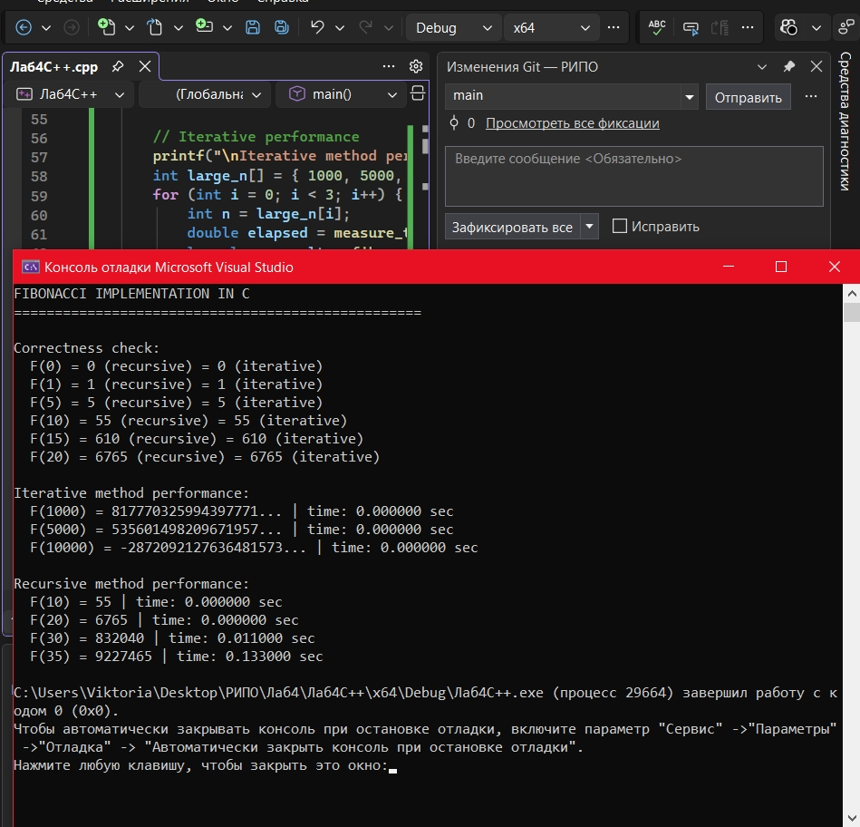
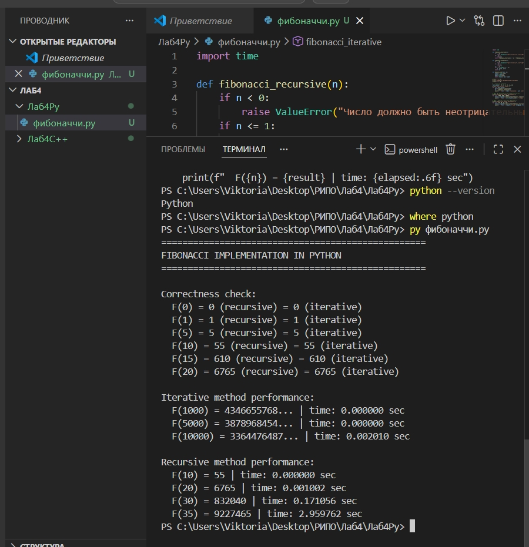

## Отчёт по лабораторной работе №4

**Дисциплина:** Разработка инструментального программного обеспечения  
**Тема:** Реализация одной и той же библиотеки на двух языках. Сравнение их эффективности, удобства использования и особенностей  
**Выполнил:** Печинин Тихомир Олегович  
**Группа:** 222  
**Дата:** 06.04.2026  

### 1. Цель работы

Научиться разрабатывать одинаковую функциональность на двух языках программирования и провести сравнительный анализ по производительности и удобству реализации.

### 2. Выбранные языки и задача

C++ — компилируемый язык, статическая типизация. Используется для высокопроизводительных вычислений и системного ПО.

Python — интерпретируемый язык, динамическая типизация. Используется для быстрой разработки, скриптов и анализа данных.

Задача — вычисление чисел Фибоначчи (рекурсивным и итеративным методами).

### 3. Результаты выполнения

#### 3.1 Реализация на C++

**Ключевые результаты C++:**
- F(1000) = 817770325994397771
- F(5000) = 535601498209671957
- F(10000) = **-2872092127636481573** (переполнение)
- Время рекурсии F(35) = 0.133 сек

#### 3.2 Реализация на Python

**Ключевые результаты Python:**
- F(1000), F(5000), F(10000) — корректные большие числа (без переполнения)
- Время рекурсии F(35) = 2.96 сек

### 4. Сравнение

Производительность (рекурсия F(35)):

C++ — 0.133 сек

Python — 2.96 сек

C++ быстрее в ~22 раза

Производительность (итеративно F(10000)):

C++ — 0.000000 сек (но с переполнением)

Python — 0.002010 сек (корректно)

Работа с большими числами:

C++ — не поддерживает (ограничение типа long long)

Python — поддерживает (любые числа)

Читаемость и простота кода:

C++ — средняя (нужно объявлять типы, управлять памятью)

Python — высокая (минималистичный синтаксис)

### 5. Выводы

C++ значительно быстрее Python, но не поддерживает большие числа и требует больше кода.

Python медленнее, но удобнее для работы с большими данными и быстрого прототипирования.

Для задач, где важна скорость и нет сверхбольших чисел, лучше подходит C++.

Для прототипирования, анализа данных и быстрой разработки — Python.
